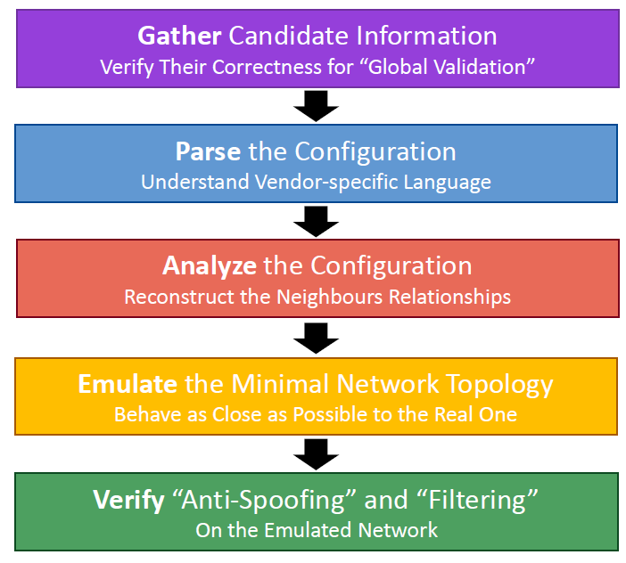
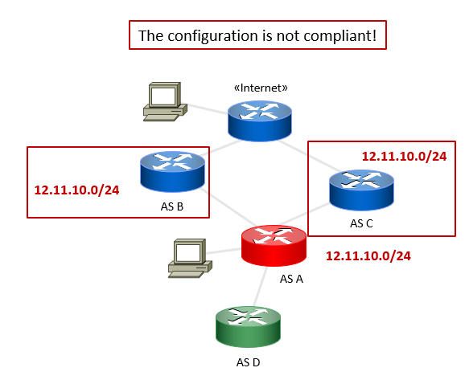
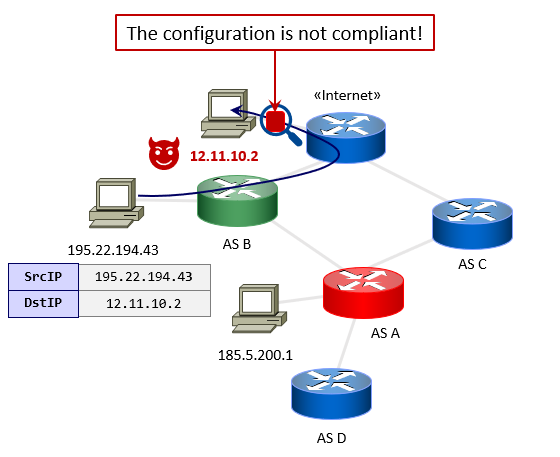

<p align="center">
  
</p>

## What is it?
**ROuting SEcurity Tool (ROSE-T)** is a network router configuration checker.

ROSE-T was born in October 2022 from an idea of [Antonio Prado](https://www.prado.it) as a research object for a PhD thesis at the University of Chieti-Pescara in Italy.
The thesis focuses on the security of routing policies to the Internet of network operators. The goal is the implementation of a method capable of verify the configurations of devices in use within Autonomous Systems (AS) also using logical formalisms applied to data extracted from sources authoritative and reliable (Regional Internet Registry and route-collectors).

The first disclosure of ROSE-T, under another name (RS4LK), was made during an "ITNOG on the road" meeting on April 19, 2023 in Pisa, Italy. The [slides](https://www.prado.it/wp-content/uploads/Routing-Security-for-lazy-kids.pdf) show an initial outline of the work in collaboration with researcher [Mariano Scazzariello](https://github.com/Skazza94). After months of effort, scholar [Tommaso Caiazzi](https://github.com/tcaiazzi) also joined the project, and today it has resulted in a software product based on a method that places logical formalism alongside emulation tools.

ROSE-T allows to ensure that a certain router configuration is MANRS-compliant to the [Network Operator Guidelines](https://www.manrs.org/netops/).

Specifically, ROSE-T performs the check for validating the following actions of MANRS:
- Action 1: **Filtering** -> Prevent propagation of incorrect routing information.
- Action 2: **Anti-Spoofing** -> Prevent packets with spoofed source IP address from entering or leaving the network.
- Action 4: **Global Information** -> Network operators must publicly document their routing policies, ASNs and prefixes.

Action 3 cannot be validated automatically since it implies to verify contact information of the candidate.  

It leverages __[Kathará](https://github.com/KatharaFramework/Kathara)__ to emulate a virtual network scenario in which the router **realistically interacts** with providers and customers.

**WARNING**: The current version is still for demonstration purposes, and it is not intended to be used in production.

## ROSE-T at RIPE
Mariano Scazzariello presented ROSE-T at RIPE87 in Rome (12/01/2023):
- Presentation and Slides: https://ripe87.ripe.net/archives/video/1262/

## How does it work?

<p align="center">
    
</p>

### Step 1: Gather Candidate Information
In this step the system checks the `Global Information` of the candidate (Action 4 of MANRS), validating the public information.

To do so, ROSE-T verifies:
1. That the networks announced to transit are in the IRR Entry.
2. That the networks in the IRR Entry are announced to transits.

### Step 2: Parse the Configuration
In this step, ROSE-T parses the required information from the vendor configuration (using a custom parser).
Mainly, it extracts interfaces' information (names and IP addresses) and BGP sessions.

### Step 3: Analyze the Configuration
In this step ROSE-T analyzes the parsed configuration to reconstruct the neighbours relationships. 
It integrates the information from the IRRs and a RIB dump to infer the topology and understand the relationships. 

### Step 4: Emulate the Minimal Network Topology
In this step the system uses the computed information to build a minimal network topology to be emulated. 
To power the emulation, ROSE-T leverages on Kathará. The candidate router will use the original configuration/vendor software, while other ASes are emulated as a single router running FRRouting. 

### Step 5: Verify Compliance to MANRS
In this step the system leverages on the emulated environment to verify Action 3 and Action 4 of MANRS. 

**Filtering (Action 1): "Ensure the correctness of your own announcements and those from your customers to adjacent networks"**

For each customer: 
  1. Select non-overlapping subnet and announce it to the candidate router.
  2. Wait that BGP converges.
  3. Check the provider's received routes using the FRR control plane.

<p align="center">
    
</p>

**Anti-Spoofing (Action 2): "Enable source address validation for at least single-homed stub customer networks, their own end-users, and infrastructure"**

For each provider:
  1. The system creates a client in the provider's AS.
  2. Assign IPs (v4/v6) to each created client.
  3. Send the spoofed ICMP packet.
  4. Check if the spoofed packet leaves the candidate AS. 
  
<p align="center">
    
</p>
  
## Supported Vendor Routers
Currently, ROSE-T supports the following vendor routers:
- **Juniper VMX** (>=18.2) through a [hellt/vrnetlab](https://github.com/hellt/vrnetlab) VM embedded in a Docker container. 
  - We use a custom version of the VM, which `.patch` files are located in the `vrnet_patches` folder.
  - **Note**: Currently, we only support __flat__ configurations.
- **Cisco IOS XR** (>=7.9.2) using the official [XRd Control Plane](https://software.cisco.com/download/home/286331236/type/280805694) Docker image.
  - You need to properly configure the host machine before running the XRd container. See [this tutorial](https://xrdocs.io/virtual-routing/tutorials/2022-08-22-setting-up-host-environment-to-run-xrd/) for more information.
    - Particularly, you have to increase the `fs.inotify.max_user_instances` and `fs.inotify.max_user_watches` to at least `64000`:
      ```bash
        sysctl -w fs.inotify.max_user_instances=64000
        sysctl -w fs.inotify.max_user_watches=64000
      ```
- **MikroTik RouterOS** (>=7.15) through a [hellt/vrnetlab](https://github.com/hellt/vrnetlab) VM embedded in a Docker container.
  - We use a custom version of the VM, which `.patch` files are located in the `vrnet_patches` folder.
  - **Note**: Currently, we only support  __non-terse__ configurations (i.e., do not `export` with the `terse` parameter).

We plan to extend the support to additional vendors in the future.

## Hands-on

1. Docker
2. Kathará
3. Python 3.10 or 3.11

### Pre-Requisites

1. Download the requisites:
```
python3 -m pip install -r src/requirements.txt
```

2. You need an updated a MRT RIB dump downloaded from a Route Collector, for example you can download the latest dump from [RRC00](https://data.ris.ripe.net/rrc00/).
Now, enter the `resources` directory, and run the `load_mrt.py` script:
```
cd resources
python3 load_mrt.py <TABLE_DUMP_RIB_FILE> <OUTPUT_FILE.db>
```
The command requires two positional parameters: 
- `<TABLE_DUMP_RIB_FILE>` is the RIB dump in `.gz` format. 
- `<OUTPUT_FILE.db>` is the name of the output SQLite3 database (stored in the `resources` directory). By default, the name is `rib_latest.db`.

## Build the patched `vrnetlab` images

1. Clone the [hellt/vrnetlab](https://github.com/hellt/vrnetlab) repository, you can clone it inside the root directory of ROSE-T:
```bash
git clone https://github.com/hellt/vrnetlab
```

2. Apply the patch located in the `vrnet_patches` folder. If you cloned `vrnetlab` in the root folder of ROSE-T:
```bash
cd vrnetlab
git apply ../vrnet_patches/<os_name>.patch
```
Where `<os_name>.patch` is the name of the patch file.

3. Now, to build the image, copy the VM file provided by the vendor (e.g., `.tar.gz` for Juniper, or `.vmdk` for RouterOS) inside the corresponding OS folder (e.g. `vmx`) and run `make`. The process will take few minutes.

**NOTE:** For now, the container name is hardcoded into ROSE-T. We plan to add a configuration parameter to specify the image name. If your image name differs, you have to manually change it.

## Run a Test

### Action 1 and 2 verification
To run the verification of Action 1 and 2, the simplest command is:
```
cd src
sudo -E PATH=$PATH python3 test.py --config_path <CONFIGURATION_PATH> --config_syntax <CONFIGURATION_SYNTAX>
```

The supported parameters are:
- `--config_path`: Path to the configuration to test.
- `--config_syntax`: The syntax of the provided configuration. Supported values are `Junos` (for VMX), `IosXr` (for Cisco IOS XR), `Routeros` (for MikroTik RouterOS).
- `--rib_dump`: Path pointing to the `.db` SQLite3 database containing the parsed MRT RIB dump. By default, the value is `resources/rib_latest.db`.
- `--exclude_checks`: A comma separated string to exclude some MANRS checks. Supported values are `spoofing` and `leak`.
- `--result-level`: The output of the validation will report both successful checks, warnings and errors. You can change the level of output with this parameters. Supported values are `WARNING`, `SUCCESS`, and `ERROR`.

The test can take up to few minutes, depending on your hardware. Ensure that you have a good amount of RAM and nested virtualization enabled.

**NOTE**: ROSE-T works only on Docker on Linux or WSL2, and it is compatible only with the `amd64` architecture (Apple Silicon is not supported).

### Action 4 verification
Currently, the Action 4 verification is a standalone Prolog program. We plan to merge the two tools in the near future.

To verify Action 4, enter the `src_prolog` directory and follow the related [README](src_prolog/README.md) file.
