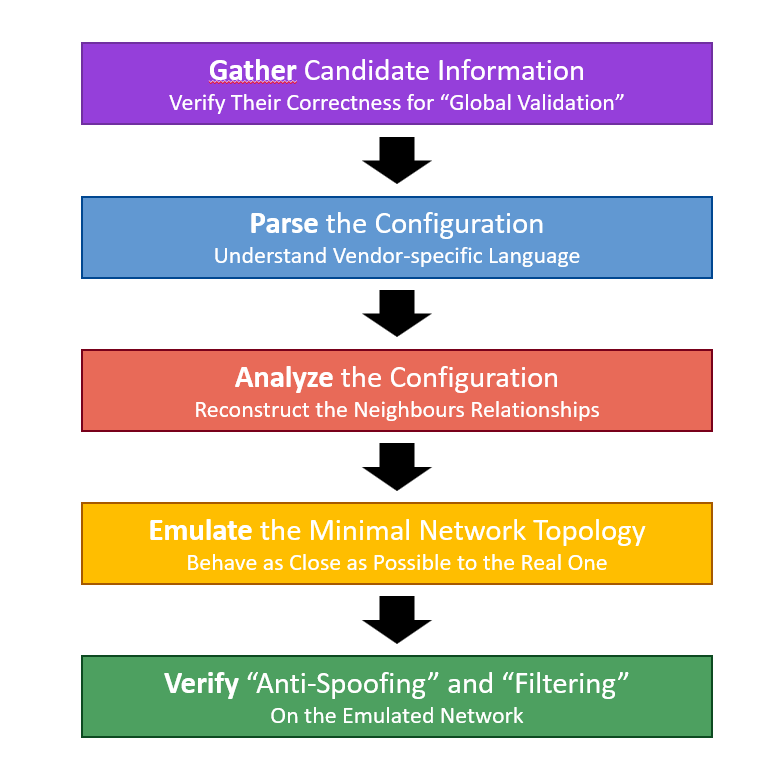

# ROuting SEcurity Tool (ROSE-T)

## What is it?
**ROuting SEcurity Tool (ROSE-T)** is a network router configuration checker.

It allows to ensure that a certain router configuration is MANRS-compliant.

It leverages:
* __[Batfish](https://github.com/batfish/batfish)__ to parse and abstract the vendor configuration.
* __[Kathará](https://github.com/KatharaFramework/Kathara)__ to emulate a virtual network scenario in which the router **realistically interacts** with providers and customers.

**WARNING**: The current version is in alpha state for demonstration purposes, and it is not intended to be used in production.

## How does it work?



### Step 1: Gather Candidate Information
In this step the system verifies: 
1. That the networks announced to transit are in the IRR Entry.
2. That the networks in the IRR Entry are announced to transits.

### Step 2: Parse the Configuration
In this step the system: 
1. Exploits Batfish to parse the vendor configurations. 
2. Enriches the information from Batfish (e.g., IPv6)

### Step 3: Analyze the Configuration
In this step the system analyzes the parsed configuration to reconstruct the neighbours relationships. 
It integrates the information from the IRRs and the candidate RIB to infer the topology and understand the relations. 

### Step 4: Emulate the Minimal Network Topology
In this step the system uses the computed information to build an emulated digital twin of the network. 
To power the emulation ROSE-T leverages on Kathará. 
The candidate router will use the original configuration, while other ASes are emulated as a single router running FRR. 

### Step 5: Verify Compliance to MANRS
In this step the system leverages on the emulated environment to verify `Action 3` and `Action 4` of MANRS. 
- Action 3 (Anti-Spoofing):
  1. For each provider the system creates a client.
  2. Assign IPs (v4/v6) to each created client
  3. Send the spoofed ICMP packet
  


- Action 4 (Filtering):
  For each customer: 
  1. Select non-overlapping subnet and announce it to the candidate router.
  2. Wait that BGP converges.
  3. Check the provider's received routes using the FRR control plane.
  

  
## Supported Vendor Routers
Currently, ROSE-T supports two Vendor Routers:
- **Juniper VMX** through a [hellt/vrnetlab](https://github.com/hellt/vrnetlab) VM embedded in a Docker container. 
  - We use a custom version of the VM, which `.patch` files are located in the `vrnet_patches` folder.
- **Cisco IOS XR** using the official [XRd Control Plane](https://software.cisco.com/download/home/286331236/type/280805694) Docker image.
  - You need to properly configure the host machine before running the XRd container. See [this tutorial](https://xrdocs.io/virtual-routing/tutorials/2022-08-22-setting-up-host-environment-to-run-xrd/) for more information.
    - Particularly, you have to increase the `fs.inotify.max_user_instances` and `fs.inotify.max_user_watches` to at least `64000`:
      ```bash
        sysctl -w fs.inotify.max_user_instances=64000
        sysctl -w fs.inotify.max_user_watches=64000
      ```

## Hands-on

### Pre-Requisites

1. Run the Batfish container:
```
docker run --name batfish -v batfish-data:/data -p 8888:8888 -p 9997:9997 -p 9996:9996 batfish/allinone
```

2. Download the requisites:
```
python3 -m pip install -r src/requirements.txt
```
3. Download the updated RIB and parse it.
```
python3 load_mrt.py <TABLE_DUMP_RIB_FILE> <OUTPUT_FILE.db>
```

By default, ROSET takes as `<OUTPUT_FILE.db>` the one in `resources/rib_latest.db`.

## Run a Test

To run a test:
```
cd src
python3 test.py --config_path <CONFIGURATION_PATH>
```
